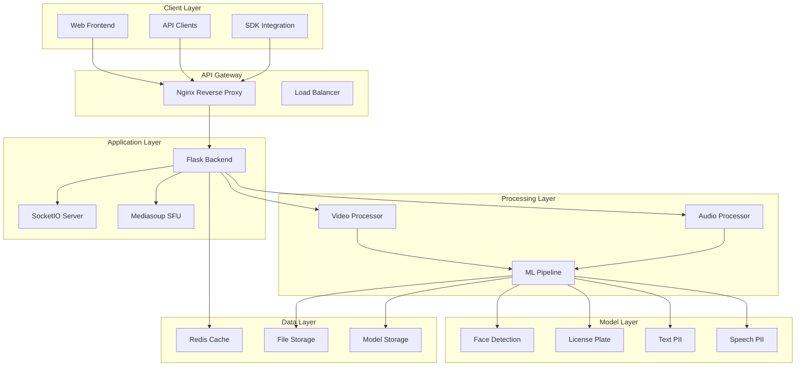
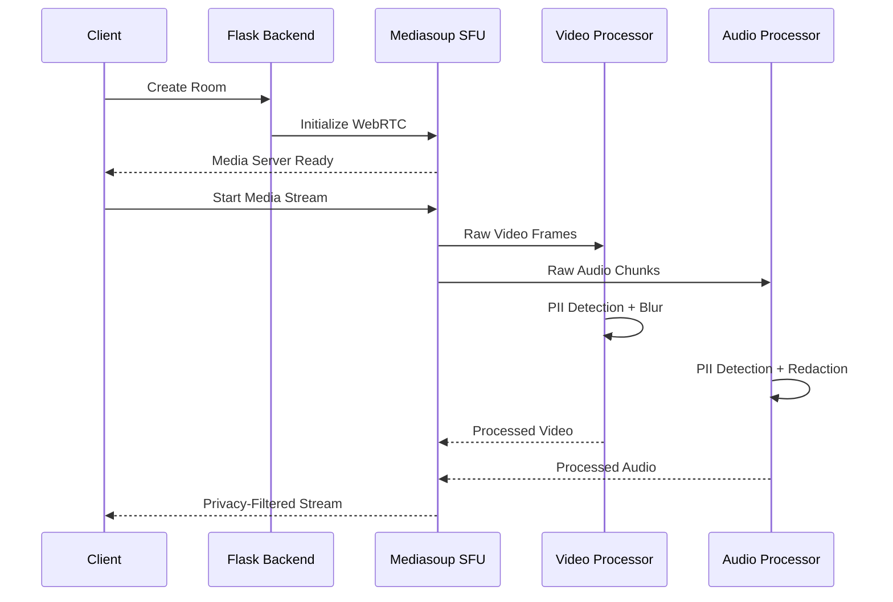
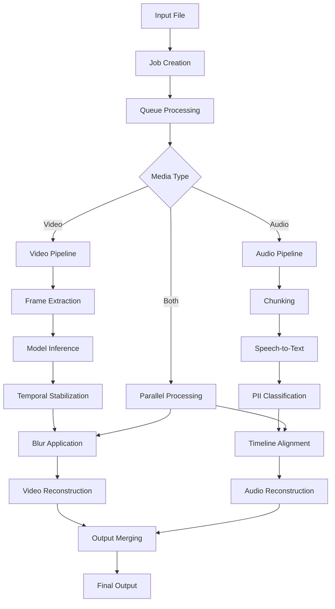

# PrivaStream Architecture Documentation

## System Overview

PrivaStream is a real-time privacy filtering platform designed to detect and redact personally identifiable information (PII) from video and audio streams. The system employs a modular, microservices-based architecture that can scale from single-machine deployments to distributed cloud environments.

## High-Level Architecture



## Core Components

### 1. Web Frontend (`src/web/frontend/`)

**Technology**: React with Next.js
**Responsibilities**:
- User interface for streaming setup
- Real-time video preview with privacy filters
- Configuration management
- Stream monitoring and controls

**Key Features**:
- WebRTC integration for real-time streaming
- Real-time preview of privacy filtering
- Room management for multi-user scenarios
- Responsive design for various devices

### 2. Flask Backend (`src/web/backend/`)

**Technology**: Python Flask with SocketIO
**Responsibilities**:
- REST API endpoints
- WebSocket communication
- Processing job orchestration
- Authentication and session management

**Key Endpoints**:
- `/api/v1/process` - Video/audio processing
- `/api/v1/jobs/{id}` - Job status tracking
- `/health` - Health monitoring
- `/socket.io/` - WebSocket communication

### 3. Mediasoup SFU (`src/web/mediasoup/`)

**Technology**: Node.js with Mediasoup
**Responsibilities**:
- WebRTC Selective Forwarding Unit (SFU)
- Real-time media transport
- Multi-participant streaming
- Bandwidth optimization

**Architecture**:
- Handles WebRTC peer connections
- Manages media routing between participants
- Provides scalable broadcasting capabilities

### 4. Video Processing Pipeline (`src/models/detection/`)

**Components**:
- **Unified Detector** (`unified_detector.py`): Coordinates all video models
- **Face Blur** (`face_blur/`): YOLO-based face detection
- **License Plate** (`plate_blur/`): License plate detection
- **Text PII** (`pii_blur/`): OCR + ML text classification

**Data Flow**:
```
Input Frame → Model Inference → Temporal Stabilization → Blur Application → Output Frame
```

**Performance Optimization**:
- Frame skipping for real-time performance (4fps detection, 30fps output)
- GPU acceleration with CUDA
- Temporal stabilization to reduce flicker

### 5. Audio Processing Pipeline (`src/models/audio/`)

**Components**:
- **Whisper Integration**: Speech-to-text transcription
- **DeBERTa Classifier**: PII classification in transcripts
- **VAD (Voice Activity Detection)**: Silence filtering
- **Real-time Processor**: Live audio stream processing

**Pipeline Flow**:
```
Audio Input → VAD → Whisper STT → DeBERTa PII → Timeline Sync → Audio Redaction
```

## Model Architecture

### Video Models

#### Face Detection Model
- **Base Model**: YOLOv8n
- **Input**: 640x640 RGB frames
- **Output**: Bounding boxes with confidence scores
- **Accuracy**: 98.38% on validation set
- **Inference Time**: ~15ms on RTX 4090

#### License Plate Detection
- **Base Model**: YOLOv8s
- **Training Data**: Singapore license plates dataset
- **mAP50**: 96.47%
- **Specialty**: Optimized for Asian license plate formats

#### Text PII Detection
- **OCR Engine**: docTR or EasyOCR
- **Classifier**: Scikit-learn Random Forest
- **Features**: Text content, position, context
- **Classes**: Name, Address, Phone, Email, ID numbers

### Audio Models

#### Speech-to-Text
- **Model**: OpenAI Whisper (small/base/large variants)
- **Languages**: Multi-language support
- **Accuracy**: 95%+ for clear speech
- **Chunking**: 5-second overlapping windows

#### PII Classification
- **Base Model**: DeBERTa-v3-base
- **Fine-tuning**: Custom PII dataset
- **Accuracy**: 96.99% (state-of-the-art)
- **Classes**: 8 PII types (NAME, EMAIL, PHONE, etc.)

## Data Flow Architecture

### Real-time Streaming Flow



### Batch Processing Flow



## Scalability Architecture

### Horizontal Scaling

#### Load Balancer Configuration
```nginx
upstream backend_pool {
    least_conn;
    server backend1:5000 weight=3;
    server backend2:5000 weight=2;
    server backend3:5000 weight=1;
}
```

#### Microservices Separation
- **API Gateway**: Request routing and authentication
- **Video Service**: Video processing instances
- **Audio Service**: Audio processing instances
- **Model Service**: Centralized model serving
- **Storage Service**: File and model management

### Vertical Scaling

#### GPU Utilization
- Multi-GPU support with CUDA
- Memory optimization for large models
- Dynamic batching for throughput optimization

#### CPU Optimization
- Multi-threading for parallel processing
- Async I/O for non-blocking operations
- Process pooling for CPU-intensive tasks

## Security Architecture

### Data Protection
- **Encryption in Transit**: TLS 1.3 for all communications
- **Encryption at Rest**: AES-256 for stored files
- **Memory Protection**: Secure memory clearing after processing
- **Access Control**: JWT-based authentication

### Privacy by Design
- **Minimal Data Retention**: Processed files auto-deleted
- **Local Processing**: Option for on-premise deployment
- **Audit Logging**: Complete processing trail
- **Anonymization**: Optional data anonymization features

## Performance Characteristics

### Real-time Performance
- **Video Processing**: 4fps detection, 30fps output
- **Audio Processing**: <500ms latency end-to-end
- **Memory Usage**: 4-8GB GPU memory typical
- **CPU Usage**: 2-4 cores per stream

### Batch Processing Performance
- **Video**: 0.5-2x real-time processing speed
- **Audio**: 5-10x real-time processing speed
- **Throughput**: 10-50 concurrent streams (hardware dependent)

## Configuration Architecture

### Environment-based Configuration
```python
class Config:
    # Model configurations
    FACE_MODEL_PATH = os.getenv('FACE_MODEL_PATH', 'models/face_best.pt')
    PLATE_MODEL_PATH = os.getenv('PLATE_MODEL_PATH', 'models/plate_best.pt')

    # Performance settings
    GPU_DEVICE = os.getenv('CUDA_VISIBLE_DEVICES', '0')
    BATCH_SIZE = int(os.getenv('BATCH_SIZE', '1'))

    # API settings
    MAX_UPLOAD_SIZE = int(os.getenv('MAX_UPLOAD_SIZE', '1073741824'))
```

### YAML Configuration Files
```yaml
# config.yaml
video:
  target_fps: 4
  output_fps: 30
  models:
    face:
      enabled: true
      confidence: 0.4
    license:
      enabled: true
      confidence: 0.25
    pii_text:
      enabled: true
      ocr: "doctr"

audio:
  whisper_model: "small"
  chunk_seconds: 5
  deberta_model: "microsoft/deberta-v3-base"
```

## Deployment Architectures

### Single Machine Deployment
```yaml
services:
  nginx:
    image: nginx:alpine
    ports: ["80:80", "443:443"]

  backend:
    build: .
    deploy:
      resources:
        reservations:
          devices:
            - driver: nvidia
              count: 1
              capabilities: [gpu]

  frontend:
    build: ./src/web/frontend

  mediasoup:
    build: ./src/web/mediasoup
```

### Distributed Deployment
```yaml
# Kubernetes deployment
apiVersion: apps/v1
kind: Deployment
metadata:
  name: privastream-video-processor
spec:
  replicas: 3
  template:
    spec:
      containers:
      - name: video-processor
        image: privastream/video-processor
        resources:
          limits:
            nvidia.com/gpu: 1
```

## Monitoring and Observability

### Metrics Collection
- **Application Metrics**: Processing times, error rates, throughput
- **System Metrics**: CPU, memory, GPU utilization
- **Business Metrics**: PII detection accuracy, user engagement

### Logging Architecture
```python
import structlog

logger = structlog.get_logger()
logger.info(
    "video_processed",
    frame_count=1000,
    processing_time=15.2,
    detections={"faces": 5, "plates": 2}
)
```

### Health Checks
- **Liveness Probes**: Basic service availability
- **Readiness Probes**: Service ready to handle requests
- **Model Health**: AI model loading and inference status

## Future Architecture Considerations

### Planned Enhancements
- **Edge Computing**: Deployment on edge devices
- **Multi-tenancy**: Support for multiple organizations
- **Model Versioning**: A/B testing and gradual rollouts
- **Real-time Analytics**: Live dashboard for processing metrics

### Scalability Roadmap
- **Auto-scaling**: Kubernetes HPA based on queue length
- **Global Distribution**: Multi-region deployments
- **CDN Integration**: Optimized content delivery
- **Serverless Components**: Event-driven processing functions

This architecture provides a robust foundation for privacy-focused media processing while maintaining flexibility for various deployment scenarios and future enhancements.